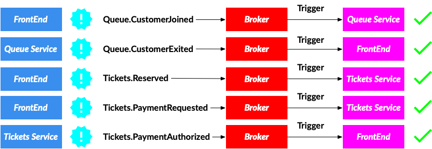
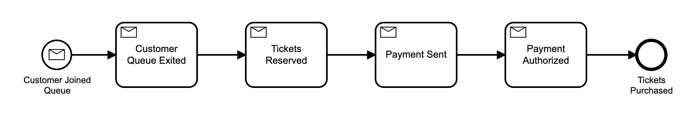
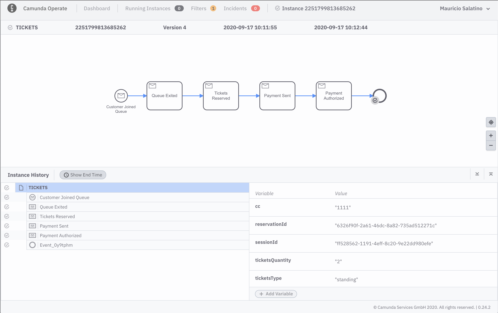
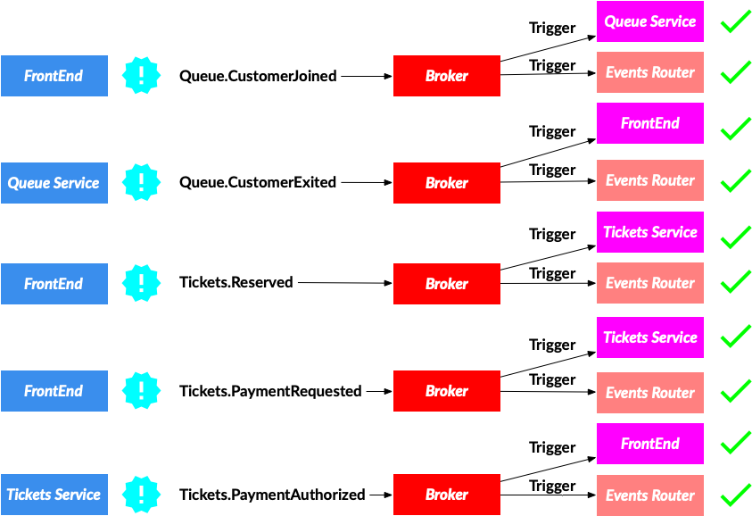
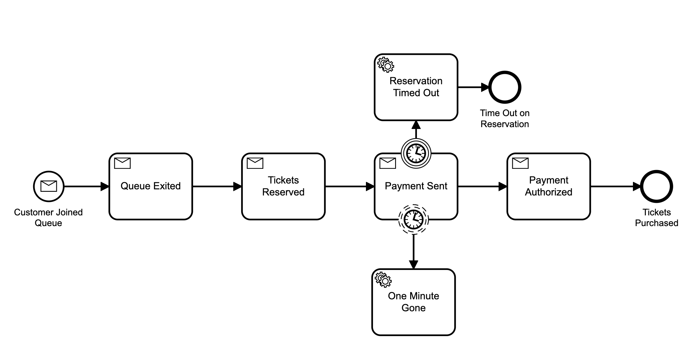
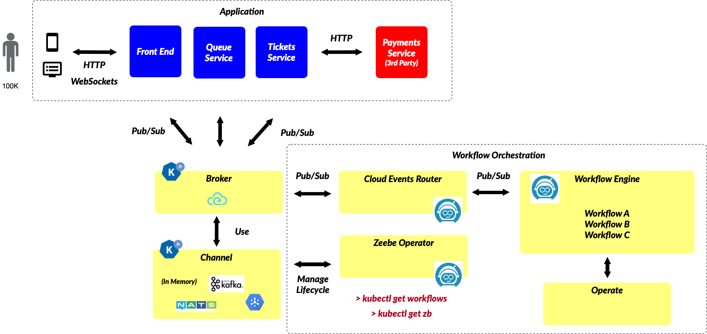
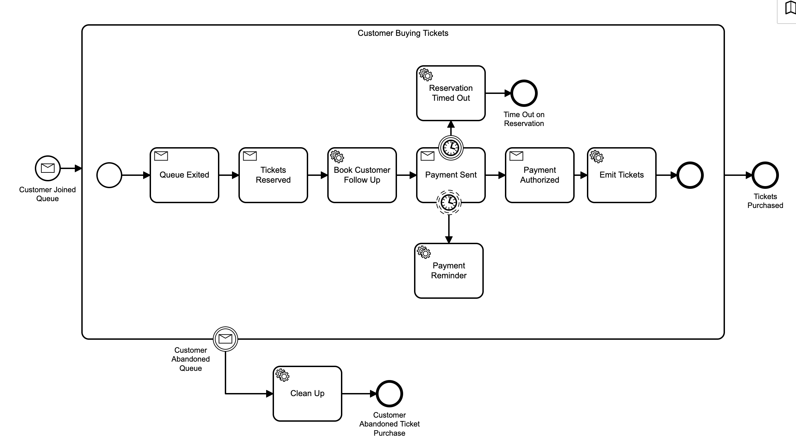
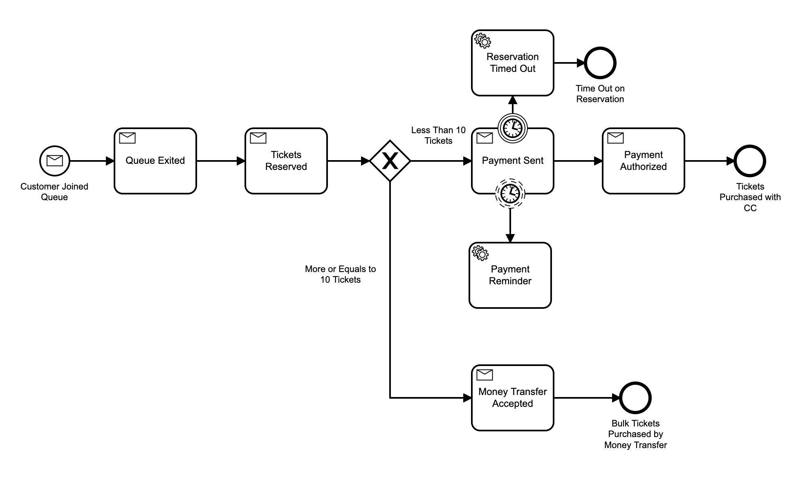

# Orchestrating Cloud Events (with Knative and Zeebe)

In this repository, you will find all the resources for the presentations named after this repository. In the reference sections you can find the links to the slides associated with those presentations. 

Source code for the example services:
- [User Interface](https://github.com/salaboy/customer-waiting-room-app)
- [Tickets Service](https://github.com/salaboy/tickets-service/)
- [Payments Service](https://github.com/salaboy/payments-service/)
- [Queue Service](https://github.com/salaboy/queue-service/)
- [Zeebe Cloud Events Router](https://github.com/zeebe-io/zeebe-cloud-events-router)
- [Zeebe Cloud Events Workflow Models](https://github.com/salaboy/zeebe-cloud-events-examples)

# Pre Requisites

- Kubernetes Cluster
- Helm 3.x installed and configured
- Install Knative 0.17.0
  - [Install Knative Serving](https://knative.dev/docs/install/any-kubernetes-cluster/#installing-the-serving-component)
  - [Install Knative Eventing](https://knative.dev/docs/install/any-kubernetes-cluster/#installing-the-eventing-component). 
    - You can install the **In Memory Channel** and the **MT-Channel-Based Broker** or
    - You can install the **Kafka** Channel and Broker

To add Zeebe you will need to choose between **Camunda Cloud** or **Zeebe in your Kubernetes Cluster with Helm**:
- [Camunda Cloud Account](https://camunda.com/products/cloud/) To run a Managed Zeebe Cluster for Microservices and Events Orchestration. It is free to try, you don't need to install anything.  
- [Zeebe Helm Charts](http://helm.zeebe.io) to host your Zeebe Cluster for Microservices and Events Orchestration in your own Kubernetes Clusters (On Prem or in a Cloud Provider) 
- [Zeebe Modeler](https://github.com/zeebe-io/zeebe-modeler/releases) to edit and deploy your workflow models.
  
  
# Scenario
A "tickets selling" company is creating a new website to sell high-demand concert tickets. In such scenarios, tickets go on sale a predefined date at a certain time (Monday 9 am for example). There are usually less tickets than people wanting to buy them, for example, 20K available tickets and 100K people waiting to buy them. 

The company needs to implement a Queue system to make sure that customers are served in a **first come/first served** basis. 

## Application flow

Application Overview (Click in the image to see video)

# Architecture
One of the possible design and architecture for such application might use an **Event-Driven** Approach to implement the application flow. 

The application is composed by 4 Services as shown in the following diagram:

- **FrontEnd**: contains the backend (REST endpoints that will be called from the client browswer and WebSocket Handler) and front end code for the application which is composed by HTML, CSS and JavaScript. The Front End application also acts as an API Gateway to route requests to the other microservices if needed.
- **Queue Service**: Contains the logic to queue Customers who want to buy tickets for concerts. The Queue Service will notify via events when a Customer enters and exit the Queue. Exiting in this context means that the Customer is allowed to proceed with the purchase. 
- **Tickets Service**: Contains the logic to reserve a certain amount of tickets for a short period of time, allowing a customer that already exited the Queue to purchase (pay for) the tickets. Failing to do so, the tickets will be released to the next Customer in line. The tickets service is also in charge of dealing with the Payments Service which is a 3rd Party Service outside of the Tickets Company. 
- **Payments Service (3rd Party)**: Third Party Serivce that expose two HTTP endpoints to process payments and to check if the transactions were approved or not. 

For these kind of architectures where you choose to use an **Event Driven** approach, using [Cloud Events](http://cloudevents.io) as a standard way of sharing events data is highly recommended as it will reduce the amount of work required to parse and emit different event formats as well as integration with 3rd party software that already consume and generate events. 

For the previous application flow, the following events are emitted and consumed by the services: 

As you can see these events repesent a single sale of tickets, in other words, the events that are emitted by a Customer going through the entire process of buying tickets for a particular concert. 

Even in the case where you choose to use Cloud Events, you can implement an HTTP based approach, sending HTTP POST requests to each service endpoint containing the Cloud Event data (using the HTTP Binding), but in more realistic scenario you might end up needing a more robust transport such as a Messaging Broker. For that you can choose to use Kafka, Active/Rabbit MQ, JMS who provide a set of guarantees on Delivery and retry mechanisms out of the box. If you are working in a Cloud Platform, the platform might provide these Message Brokers as services, such as Google Pub/Sub or AWS Amazon MQ. 
For this demo, using Knative Eventing provide us with an abstraction on top of all these Message Broker providers, allowing our applications to stop caring which implementation is being used under the hood. 

If we decide to use Knative the architecture look like this: 

When using Knative, each service will need to create a trigger (a subscription for the messages that the application is interested in getting). The Application currently works with the following Knative Triggers. 

In the left-hand side of the diagram you can see the Service/Application that produce the event as well as the type and on the right-hand side you can see the Service/Application that is registering a trigger to consume those types. 

## Adding Zeebe to the Mix

The first thing that you can do with Zeebe is to gain visibility of what is going on in your applications by tapping into the Application/Services events. 

You can do this by creating a workflow model to capture these events: 

This provides us **Visibility** and understanding about how things are going in our distributed applications. By just adding a model and tapping into the Knative Event Broker that is handling the application messages, we can quickly understand where our applications flows are at any giving point in time. You can use Operate to monitor the executions. 

From an architectural point of view you are just tapping into the existing application events.  

As you can imagine, now you now need to create the **Knative Triggers** (Subscriptions) to be also routed to the Cloud Events Router so the workflow engine can tap into these events. 

The following video show the first version of our model in action (click to open in YouTube): 

Then you can proceed to **decorate/enchance** your models with features provided by the workflow engine. A common business requirement are notifications and time-based reminders. 

In the second version of the workflow model, you can see two **Timer Boundary Events** attached to the **Payment Sent Receive Task**. The bottom one, represents a non-interrupting behaviour, which means that the flow is not going to be interrupted by this event. It is configured to send a reminder to the user every 10 seconds. 

The top one, is an **Interrupting Timer Boundary Event** which, when fired, will interrupt the normal flow of our model. In such situation (after X minutes), the reservation time out, and you can enforce in the backend (by creating new subscrition for these events) to clean up and release the current reservation's tickets. 

Both Timer Events are connected to **Service Tasks** that in this setup can be configured to **emit Cloud Events**.

The following video show the second version of our model in action (click to open in YouTube): 

Because now you are interested also in emitting events, it makes sense to look into more details of the architecture and how Zeebe integrates with Knative: 

You can deploy the second version of the model, as the Application Front end is ready to accept the new Cloud Events produced by the model. You should see notifications being pushed to the client side (Browser) via websockets in the payment screen. 

Finally, there is nothing stopping you to do a full orchestration of your events, that means to take control of consuming and emitting events when needed to define the flow of the application. 

The third version of the model emits Cloud Events at different stages, which are now part of the main flow of the application. In this version you can clearly track how many customer abandoned the purchase flow and at which stage. 

The following video show the third version of the model in action (click to open in YouTube): 

Version four shows how you can add flow control constructs to decide how the flow should go under specific circumstances. In this example you can see that for larger orders a different payment method is required. 

# Install Services
All the services are packaged as Helm Charts and can be installed from the following Helm Repository, or built from source. 

> helm repo add zeebe-internal http://chartmuseum-jx.35.230.155.173.nip.io/charts/
> helm repo update

## Installing Tickets Service

> helm install tickets zeebe-internal/tickets-service --set env.K_SINK=http://broker-ingress.knative-eventing.svc.cluster.local

## Install Payments Service
> helm install payments zeebe-internal/payments-service --set env.K_SINK=http://broker-ingress.knative-eventing.svc.cluster.local

## Install Queue Serivce 

> helm install queue zeebe-internal/queue-service --set env.K_SINK=http://broker-ingress.knative-eventing.svc.cluster.local

## Install Front End

> helm install frontend zeebe-internal/customer-waiting-room-app --set env.PAYMENTS_SERVICE=http://payments-service.default.svc.cluster.local --set env.PAYMENTS_SERVICE_EXTERNAL=http://payments-service.default.34.91.231.32.xip.io --set env.QUEUE_SERVICE=http://queue-service.default.svc.cluster.local --set env.TICKETS_SERVICE=http://tickets-service.default.svc.cluster.local

## Install Zeebe Cloud Events Router

Before installing the Zeebe Cloud Event Router you need to have a Zeebe Cluster ready to be able to provide the connection details to the Router. 
This component is in charge of routing Cloud Events in and out of the Zeebe Cluster and do the mappings between BPMN constructs and Event Types. More information about the [Zebee Cloud Events router here](https://salaboy.com/2020/05/18/orchestrating-cloud-events-with-zeebe/).

You can create a Zebee Cluster hosted in Camunda Cloud with a few clicks after registering. 

Once you create the Cluster you need to create the client credentials, you can have multiple clients connecting to the Zeebe Cluster. 

Once the Client is created you can access the **Connection Information** that you will use in the next step

Depending if you are going to use a Camunda Cloud Account or your hosted Zeebe Cluster you will need to change the ENVIRONMENT variables provided to the following command: 

> helm install cloud-events-router --set env.ZEEBE_CLIENT_BROKER_CONTACTPOINT=**<CONTACT_POINT>** --set env.ZEEBE_CLIENT_ID=**<CLIENT_ID>** --set env.ZEEBE_CLIENT_SECRET=**<CLIENT_SECRET>** --set env.ZEEBE_AUTHORIZATION_SERVER_URL=https://login.cloud.camunda.io/oauth/token --set env.ZEEBE_CLIENT_SECURITY_PLAINTEXT=false   zeebe-internal/zeebe-cloud-events-router

**<CLIENT_ID>**, **CLIENT_SECRET>** and **<CONTACT_POINT>** can be obtained after creating a Cluster in Camunda Cloud and then creating a Client, as shown in the  screens above. 

## Checking that all your services are correctly installed

If you run `helm list` you should get the following (or similar) output:

If you run `kubectl get ksvc` (Knative Services) you should see two `payments-service` and `customer-waiting-room-app` which is our frontend:

Finally, if you run `kubectl get pods` you should see all the pods and replicas for the services, by default they are configured to have just a single replica. The two Knative Services (payments and frontend) have two containers inside the pod, as Knative automatically inject a sidecar (proxy container) to route traffic.

## Zeebe & Knative Integration

A more detailed view of the Zeebe Components is shown in the following diagram: 

# Questions? Issues? want to contribute to make it better?  Please get in touch

All the services, code and frameworks used here are Open Source, so I invite you to contribute back to make them better. 

If you have any questions, doubts or you want to contribute please create in issue in this repository or drop me a message in [twitter @salaboy](http://twitter.com/salaboy). Let's create aweomse things together! 

# Conferences
- [TDC Sao Paulo 2020 - Slides](https://www.slideshare.net/salaboy/cloud-events-orchestration-with-knative-and-zeebe/)
- **Knative Meetup 2020 - Sept** 
  - [Slides](https://www.slideshare.net/salaboy/orchestrating-cloud-events-knative-meetup-2020)
  - [Recording/Video](https://www.youtube.com/watch?v=vOSsHp-6gto&feature=emb_logo)
